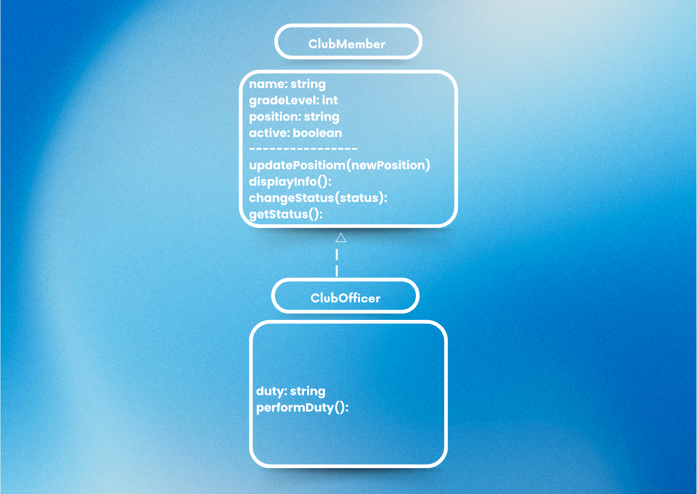

# Advanced Class Relationships

## Previous Activities
[Class Attributes](classAttributesMethods.md)

[Class Relationships](classRelationships.md)

## Existing System Description:
1. What classes currently exist in your system?
Class 1: ClubMember
Class 2: Club

2. What problem or limitation exists in your current design?
- One limitation is that some club members may have additional responsibilities that are not represented in the original ClubMember class. For example, club officers may have duties such as managing events or leading members. Creating a specialized child class can add these features without unnecessarily repeating the existing member information.

## Inheritance Relationship
Parent:

ClubMember 

Child:

ClubOfficer

Explanation:

A ClubOfficer is a type of ClubMember because very club officer is also a student member of the club. A club officer needs the same basic information as a regular member, such as name, grade level, position, and active status. The child class then can add officer-specific information or actions.

## Inheritance UML

## Composition/Aggregation
Relationship:

Aggregation 

Explanation:

The relationship between Club and ClubMember is aggregation because  Club contains members, but a ClubMember can exist independently of the Club object. For example, a student can still exist as a ClubMember object even if the club object is removed.

## Advanced UML Diagram

## Python Implementation
[Source Code](advancedRelationships.py)

## Test Run

## Object Diagram

## Reflection
Answers:
1. Why did you choose your inheritance relationship?
- I chose ClubOfficer as a child class of ClubMember because a club officer is still a member of the club. The officer needs the same basic information as other members, such as name, grade level, position, and active status. ClubOfficer also has an additional duty attribute and performDuty() method for responsibilities specific to officers. Therefore, the IS-A relationship between ClubOfficer and ClubMember makes sense.

2. How did inheritance reduce duplicate code?
- Inheritance reduced duplicate code because ClubOfficer does not need to redefine the attributes and methods already available in ClubMember. The super().__init__() statement reuses the parent class constructor to initialize the name, grade level, position, and active status. ClubOffcier can also use methods such as displayInfo() and getStatus() from ClubMember. This allows the child class to focus only on its additional officer-specific features.

3. Why is your HAS-A relationship Aggregation?
- The relationship between Club and ClubMember is aggregation because the members can exist independently from the club object. The ClubMember objects are created separately before they are added to the club. For example, member1 exists before club1.addMember(member1) is called. Therefore, deleting the Club object would not mean that the ClubMember objects must be deleted.

  4. What is the difference between Association from Part III and the advanced relationship you implemented?
- The association from Part III showed that a Club contains or is connected to ClubMember objects. In Part IV, this relationsip is identified more specifically as aggregation., which explains that the members can exist independently from the club. Part IV also adds inheritance, where ClubOfficer is a specialized type of ClubMember. Therefore, Part IV gives more detail about how objects are related and how code can be reused.

5. How does your design follow the DRY principle?
- My design follows the DRY principle because common ClubMember information and methods are written only once in the parent class. ClubOfficer inherits these features instead of creating duplicate versions of them. the child class only ads duty attribute and performDuty() method that are specific to officers. Using inheritance and supper().__init__() therefore reduces repeated code.
