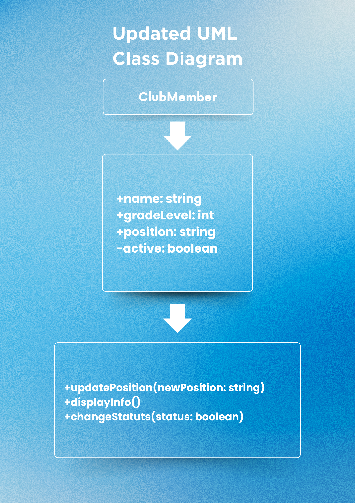
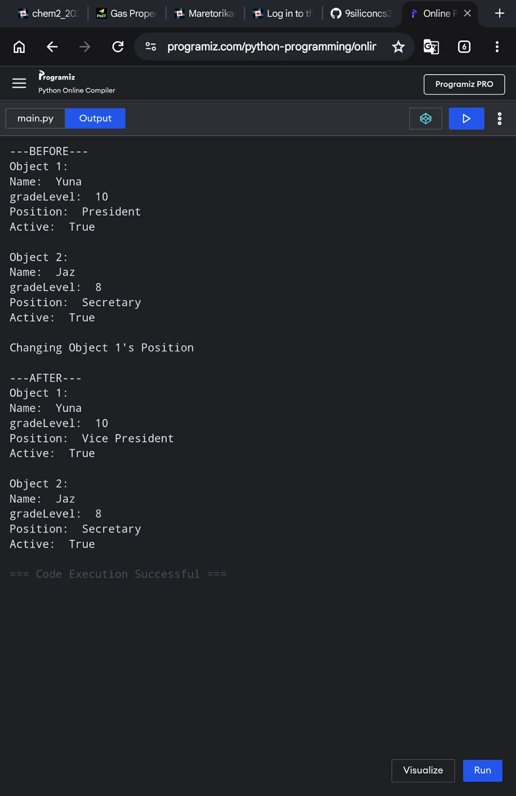
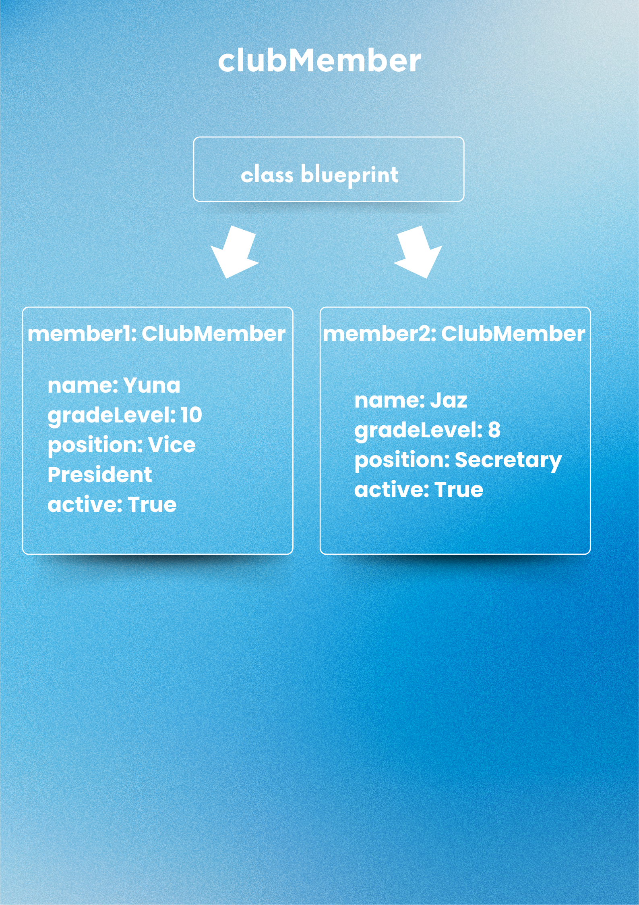

# Class Attributes and Methods
## Previous Design
Link to my previous activity:
[classObjectUML.md](classObjectUML.md)
## Design Revision
No major changes were needed from my original design.
## Visibility Decisions
| Attribute | Data Type | Visibility | Reason |
|---|---|---|---|
| name | string | Public | Name of the club member|
| gradeLevel | int | Public | Grade level of the member |
| position | string |  | Role or position of the member in the club |
| active | boolean | | Indicates whether the member is currently active |
## Updated UML Class Diagram

## Python Implementation

[View Python Source](classImplementation.py)
## Test Run

## Object Diagram

## Analysis
### Why did you make your chosen attribute private?
- I made the active attribute private because the membership status should not be changed directly by other parts of the program. Using a method to change it gives the class more control over how the status is updated. If another part of the program changed it incorrectly, the membership's status could become inaccurate. Making it private helps protect the object's internal state.

### Which method changes the state of your object?
- The updatePosition() method changes the state of my clubMember object. It changes the position attribute to a new position given through the parameter. For example, Object 1's position changed from President to Vice President. This shows that a method can modify the state of an object.
  
### How did your two objects demonstrate that instances are independent?
- My two objects, member1 and member 2, were created from the same clubMember class but had different values. When I changed the position of member1, the position of member2 stayed as Secretary. This proves that each object has its own separate state. Changing one object does not automatically change another object.
  
### What is the difference between your class diagram and your object diagram?
- The class diagram shows the blueprint of the clubMember class, including its attributes, data types, and methods. The object diagram shows actual objects created from that class and their current values. For example, the class diagram says that name is a string, while the object diagram shows that member1 has the name Yuna. Therefore, the class diagram describes what objects can have, while the object diagram shows what the objects actually contain.
