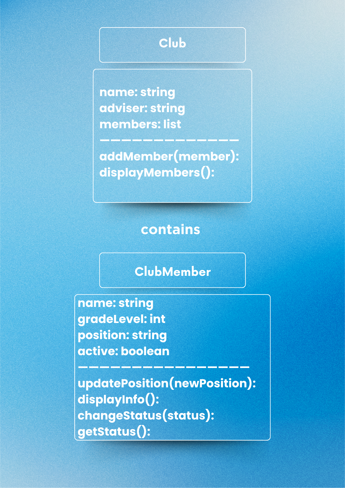
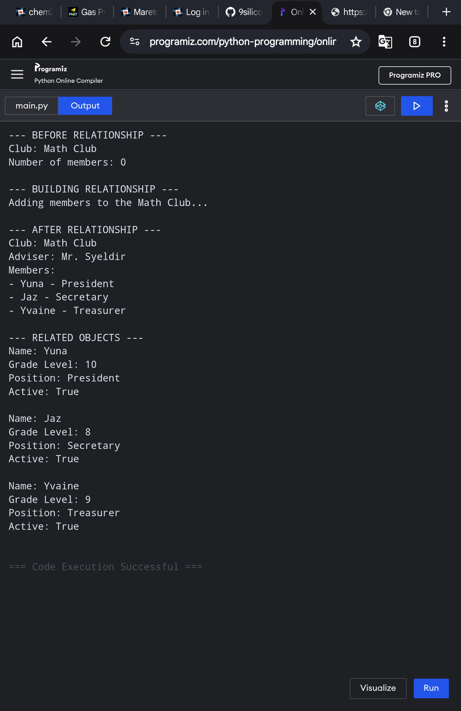
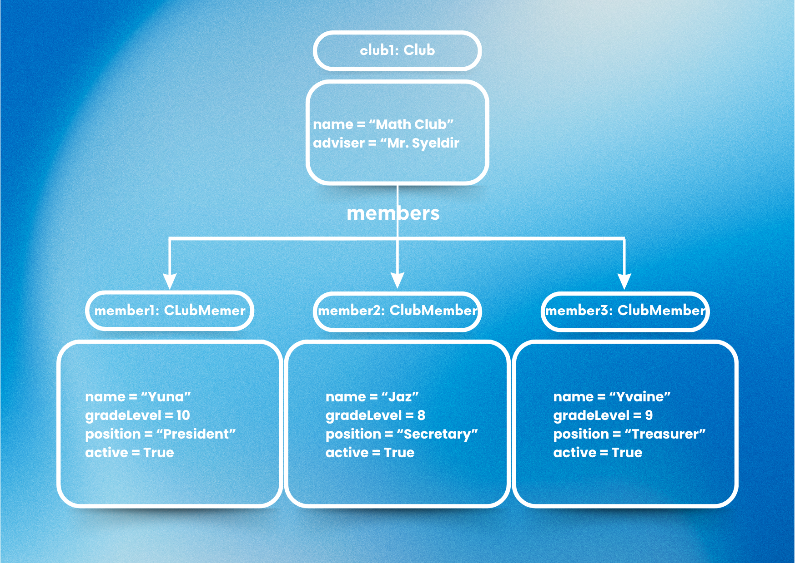

# Class Relationships: Association and Multiplicity
## Previous Work
[Part I - Classes and Objects](classObjectUML.md)

[Part II - Class Attributes and Methods](classAttributesMethods.md)
## Existing Class
Class: ClubMember

Description: A ClubMember represents a student who is a member of a school club. It stores information about the student, such as their name, grade level, position, and membership status, and can perform actions related to their membership.

## New Related Class
Class: Club

Description: A Club refers to a school organization of ClubMembers who share the same interests. There are various clubs on every school, such as Academic and Literary Club, Arts and Creativity Club, and Sports Club,  with several fun and interesting activities like solving puzzles, performing in school events, and playing team sports.

## Association
Relationship:

Explanation:

## Multiplicity
Multiplicity: One-to-Many

Explanation: One club can have many members to provide a wider variety of social relationships. Members can build friendships with other members that share their exact interests and it keeps the club from shutting down because when old members leave, there are still members who are in the club.

## UML Class Relationship Diagram

## Python Implementation
[View Python Source](classRelationships.py)

## Test Run

## Object Relationship Diagram

## Analysis
### What is the association between your two classes?
### What multiplicity did you choose and why?
### How did you implement the relationship in Python?
### Why did you store an object reference instead of copying its data?
### If your relationship uses many, why is a list appropriate?
